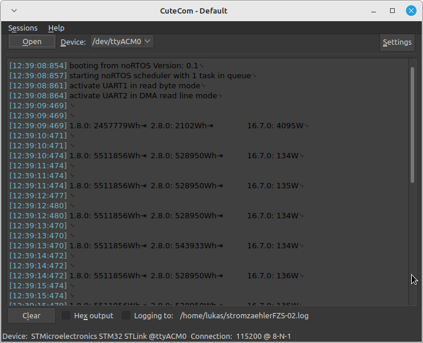

# Spaghetti-alle-vongole
Protocol Converter for Optical-Interface at Energie Meters, SML, Infrared transmitter

# About
This is my first approach of low budget data reader for Energie Meter with optical interface.

# Requirements
- optical interface breakout e.g. from [ebay](https://www.ebay.de/itm/285350331996?_trkparms=amclksrc%3DITM%26aid%3D1110006%26algo%3DHOMESPLICE.SIM%26ao%3D1%26asc%3D20220405142716%26meid%3Da39a4b830442481ca9af5d633cc26f19%26pid%3D101506%26rk%3D7%26rkt%3D10%26sd%3D314015558154%26itm%3D285350331996%26pmt%3D1%26noa%3D1%26pg%3D4481478%26algv%3DDefaultOrganicWebWithV11WebTrimmedV3VisualRankerWithKnnV3AndUltBRecall&_trksid=p4481478.c101506.m1851)
- microcontroller dev board, I use a STM32F446RE Nucleo

# How it works
The optical reader triggers the UART RX interrupt (bytewise) on the microcontroller side. 
As soon as the SML typical start/end sequence was detected it will fire the SML-decoder. 
The SML-Telegram received (in some sources also referred as SML-File) is a rather strange protocol. 
Its seems very messy and contains a lot of useless 'no value' variables (see conditions.txt). 
The decoder I implemented myself is pretty straight forward. 
It searches for relevant OBIS-Codes and than mask out the specific bytes and calculates the values with bit-shifting. 

There are two modes of operation. 
1st mode prints received characters to terminal.
You could record these lines and analyze them "offline". 
It seems that each Energie Meter somehow transmit more or less data in its own order. 
They all talk SML-Protocol but they do in various quantity.  

```C
// override the noRTOS init function
// the rest of this application is done by interrupts
void noRTOS_setup(void) {
	sml_uart_terminal_bridge_setup();
}
```
The uart interrupt callback looks like this   
```C
void sml_read_char_callback(void){
#if defined(SML_DECODER_MODE_1)
	sml_print_bytes_on_terminal();
#endif

	if(sml_check_for_start_sequence(uart_IR_rx_buffer)){
#if defined(SML_DECODER_MODE_1)
		// start sequence detected, start a new line on terminal
		printf("\t HIT \n");
#elif defined(SML_DECODER_MODE_2)
		sml_telegram_read_compleat = true;
#endif
	}
	// increment pointer on char buffer
	ir_buffer_head++;
	// prevent pointer from increase more than buffer length
	ir_buffer_head = ir_buffer_head & 0x1FF;
	// activate interrupt based, byte wise uart read
	UART_IR_READ_BYTE_IRQ( &uart_IR_rx_buffer[ir_buffer_head] );
}
```

2nd mode decodes "online" and prints the results of OBIS-Code 1.8.0, 2.8.0 and 16.7.0.  

```C
noRTOS_task_t sml_main_t = { .delay = eNORTOS_PERIODE_10ms, .task_callback = sml_main };
noRTOS_add_task_to_scheduler(&sml_main_t);
noRTOS_run_scheduler();
// never get here !
```

```C
void sml_main(void){

	if(sml_telegram_read_compleat){
		sml_telegram_read_compleat = false;
		uint16_t hit = 0;

		sml_search_byte_pattern((char*)uart_IR_rx_buffer, sizeof(uart_IR_rx_buffer), (char*)obis_code_power, sizeof(obis_code_power), &hit);
		int32_t power = (uart_IR_rx_buffer[hit+15] << 8 )| uart_IR_rx_buffer[hit+16];

		sml_search_byte_pattern((char*)uart_IR_rx_buffer, sizeof(uart_IR_rx_buffer), (char*)obis_code_energieP, sizeof(obis_code_energieP), &hit);
		int32_t energieP = (uart_IR_rx_buffer[hit+25] << 24 ) | (uart_IR_rx_buffer[hit+26] << 16) | (uart_IR_rx_buffer[hit+27] << 8) | uart_IR_rx_buffer[hit+28];

		sml_search_byte_pattern((char*)uart_IR_rx_buffer, sizeof(uart_IR_rx_buffer), (char*)obis_code_energieN, sizeof(obis_code_energieN), &hit);
		int32_t energieN = (uart_IR_rx_buffer[hit+22] << 16) | (uart_IR_rx_buffer[hit+23] << 8) | uart_IR_rx_buffer[hit+24];

		printf("\n\n1.8.0: %ldWh\t2.8.0: %ldWh\t 16.7.0: %ldW\n", energieP/10, energieN/10, power);
	}
}
```

with OBIS 'key-words' being

```C
static uint8_t obis_code_power[] =      {0x77, 0x07, 0x01, 0x00, 0x10, 0x07, 0x00, 0xFF,};
static uint8_t obis_code_energieP[] =   {0x77, 0x07, 0x01, 0x00, 0x01, 0x08, 0x00, 0xFF,};
static uint8_t obis_code_energieN[] =   {0x77, 0x07, 0x01, 0x00, 0x02, 0x08, 0x00, 0xFF,};
```

Output of mode 2 in terminal will look like this


# todo
- build a small battery driven custom PCB with IR receiver, small MCU, CAN / Modbus and SD card 
- add some wireless technology or port the code to ESP32 or nRF microcontroller
- add some proper SML-Protocol converter library
- create proper output stream like JSON or CAN-Message
- add the output to some sort of web server based gui

# Sources
[Stefan Weigert](https://www.stefan-weigert.de/php_loader/sml.php)  

[Medium Matthias Roeckl](https://medium.com/@mroeckl/h%C3%B6re-was-dein-stromz%C3%A4hler-dir-zu-sagen-hat-smart-message-language-de18556fc4b4)  

[Ploesch](https://ploesch.de/index.php?side=g-electricmeter)  

[The Ginthers](https://www.the-ginthers.net/projects/glab/GLAB%20Smart%20eHZ%20USB%20-%20RS232%20Interface%20v1.1.htm#_Toc524455858)  

[SML Protocol on Wikipedia](https://de.wikipedia.org/wiki/Smart_Message_Language)  

The Mole  